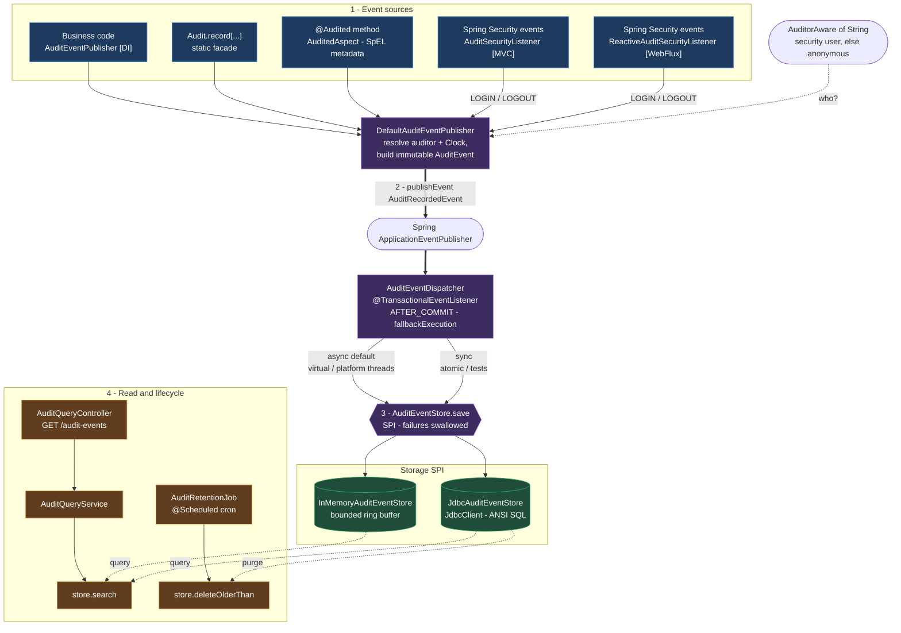

# audit-events

A production-ready Spring Boot **audit events** starter for **Java 25** / **Spring Boot 4.1.x**.

Record audit events with minimal setup: no database required to start, opt-in JDBC
persistence, automatic LOGIN/LOGOUT capture for interactive logins via Spring Security,
annotation- and code-based publishing, a flexible query REST API, and a retention purge job.

## Modules

| Module | Purpose |
|---|---|
| `audit-events-core` | Model (`AuditEvent`), public API (`AuditEventPublisher`, `Audit`, `@Audited`), SPI (`AuditEventStore`) |
| `audit-events-autoconfigure` | Stack-neutral auto-configuration (stores, AOP aspect, REST API, retention) |
| `audit-events-autoconfigure-mvc` | Servlet (Spring MVC) Security: user attribution + LOGIN/LOGOUT |
| `audit-events-autoconfigure-webflux` | Reactive (WebFlux) Security: user attribution + LOGIN/LOGOUT |
| `audit-events-spring-boot-starter-mvc` | One-dependency entry point for **servlet (MVC)** apps |
| `audit-events-spring-boot-starter-webflux` | One-dependency entry point for **reactive (WebFlux)** apps |

## Architecture

Events flow through a single pipeline: many **sources** funnel into one publisher, which emits a
Spring application event; an `@TransactionalEventListener` then persists it **after commit**, off the
business thread. The write side (publish → persist) and the read side (query / retention) meet only at
the `AuditEventStore` SPI.



**Why it's shaped this way:** the publisher only resolves *who* and *when* and fires an event — it
never touches I/O, so the business thread never blocks. Decoupling via `AuditRecordedEvent` lets the
dispatcher wait for the transaction to commit (rolled-back work is never audited) and move persistence
onto a virtual-thread executor. Everything downstream depends only on the `AuditEventStore` SPI, so
swapping in-memory ↔ JDBC ↔ your own store changes nothing on the write or read path.

## Quick start

```xml
<!-- Servlet (Spring MVC) apps -->
<dependency>
    <groupId>com.acme.audit</groupId>
    <artifactId>audit-events-spring-boot-starter-mvc</artifactId>
    <version>0.1.0-SNAPSHOT</version>
</dependency>
```

For **reactive (WebFlux)** apps, use the WebFlux starter instead - same configuration and API, with a
reactive Security integration (see [Reactive (WebFlux) apps](#reactive-webflux-apps)):

```xml
<dependency>
    <groupId>com.acme.audit</groupId>
    <artifactId>audit-events-spring-boot-starter-webflux</artifactId>
    <version>0.1.0-SNAPSHOT</version>
</dependency>
```

That's it - the app starts with an in-memory store and captures LOGIN/LOGOUT from
**interactive logins** if Spring Security is present. Stateless (JWT/bearer) apps record
LOGIN/LOGOUT themselves - see [Login/logout events](#loginlogout-events).

### Publishing events

```java
// 1) Dependency injection
@Service
class OrderService {
    private final AuditEventPublisher audit;
    OrderService(AuditEventPublisher audit) { this.audit = audit; }

    void create(Order order) {
        audit.publish("ORDER_CREATED", "Order #" + order.id());
    }
}

// 2) Static import
import static com.acme.audit.Audit.record;
record("ORDER_SHIPPED", Map.of("orderId", id, "carrier", "DHL"));

// 3) Annotation (Spring AOP)
@Audited(type = "ORDER_CANCELLED", metadata = "#order.id")
public void cancel(Order order) { ... }
```

Event types are plain strings, so you can use any convention you like. The metadata argument
accepts any object: a `String` (or `CharSequence`) is stored as-is, anything else is
serialized to JSON.

`publish(...)`, `publishAs(...)` and `Audit.record(...)` also accept an **enum** as the type - it is
stored as its `name()`, so you can keep your type codes in an enum instead of loose strings:

```java
enum OrderAuditType { ORDER_CREATED, ORDER_SHIPPED, ORDER_CANCELLED }

audit.publish(OrderAuditType.ORDER_CANCELLED, "#order.id");   // stored type = "ORDER_CANCELLED"
```

(The `@Audited` annotation stays string-based - `type = "ORDER_CANCELLED"`.) Alternatively, keep
plain string codes in one place:

```java
public final class OrderAuditTypes {
    public static final String ORDER_CREATED = "ORDER_CREATED";
    public static final String ORDER_SHIPPED = "ORDER_SHIPPED";
}
```

## Configuration

```yaml
framework:
  audit-events:
    enabled: true                 # master switch; set false per-env for a full no-op
    zone: America/Toronto         # ZoneId for the audit clock and the calendar-based retention math

    storage:
      type: in-memory             # in-memory | jdbc
      in-memory:
        capacity: 1000
      jdbc:
        datasource-bean: ""       # bean name; empty -> @AuditDataSource / @Primary
        table-name: audit_events
        schema-init: false        # dev-only; detects PostgreSQL/MySQL/SQL Server and runs the matching DDL

    async:
      enabled: true               # false -> synchronous (tests / atomic auditing)
      mode: virtual               # virtual | platform
      platform-pool-size: 4

    security:
      login-events-enabled: true    # auto LOGIN on interactive login; no effect for stateless flows
      logout-events-enabled: true

    api:
      enabled: false              # REST query API off by default
      base-path: /audit-events    # the query endpoint is served at <base-path>

    retention:
      enabled: false
      max-age: 7y                 # java.time.Period: y / m / w / d
      batch-size: 5000            # bounded deletes to avoid long locks
      cron: "0 0 3 * * *"
```

## Login/logout events

When Spring Security is present, the starter records:

- **LOGIN** on every `InteractiveAuthenticationSuccessEvent` - i.e. an actual interactive login
  (form login, OAuth2 login, remember-me). One record per login, attributed to the authenticated
  user (`createdBy`).
- **LOGOUT** on every `LogoutSuccessEvent`.

Toggle each via `framework.audit-events.security.login-events-enabled` /
`logout-events-enabled`.

### Who gets recorded as `createdBy`

The auditor recorded on every event is resolved from the current `Authentication` by an
`AuditPrincipalResolver` - a single functional interface (`Authentication -> String`) that decides
who an event is attributed to, used for LOGIN/LOGOUT and for the `createdBy` of every audited event:

```java
@FunctionalInterface
public interface AuditPrincipalResolver {
    String resolve(Authentication authentication);
}
```

**Default (OAuth2/OIDC only).** Out of the box the resolver handles interactive OAuth2/OIDC logins:
it records the `preferred_username` claim, falling back to `Authentication.getName()` only when that
claim is absent. This matters because for OAuth2/OIDC logins `getName()` is the configured name
attribute - frequently the opaque `sub` claim - which makes for a poor audit trail.

For **any other authentication** (JWT/bearer resource-server tokens, username/password, custom
principals) the default resolver **throws** `IllegalStateException` - there is no sensible universal
mapping, so you are required to provide one:

**Override.** Declare your own bean to attribute events however you need - a different claim, a
composite value, a lookup - and it replaces the default:

```java
@Bean
AuditPrincipalResolver auditPrincipalResolver() {
    return authentication -> {
        if (authentication.getPrincipal() instanceof Jwt jwt) {
            return jwt.getClaimAsString("email");
        }
        return authentication.getName();
    };
}
```

The resolver is only invoked for non-anonymous authentications; returning `null` or a blank value
attributes the event to the anonymous auditor.

### Stateless apps (JWT / bearer tokens)

A stateless resource server has **no interactive login moment** - it validates a bearer token on
every request, so there is no `InteractiveAuthenticationSuccessEvent` to hook. The login actually
happens elsewhere (the token-issuing endpoint, an OAuth2 gateway, or the identity provider).

**Disable the automatic LOGIN/LOGOUT capture on these apps:**

```yaml
framework:
  audit-events:
    security:
      login-events-enabled: false
      logout-events-enabled: false
```

Why disable it rather than leave the defaults on:

- **It cannot observe the real login.** The interactive event never fires in a stateless flow, so
  the automatic capture would record nothing for login - leaving the defaults on gives a false
  impression that login auditing is handled when it is not.
- **What it *could* catch is misleading.** Any authentication the resource server does happens
  per request, so an automatic "LOGIN" there marks every request, not a sign-in - noise, not signal.
- **Ownership must be explicit.** Since the login happens outside this service, the application has
  to record it deliberately. Turning the defaults off makes that ownership clear and avoids a
  half-working, half-silent setup.

Then record LOGIN/LOGOUT **where the login truly occurs**, using the same publisher API:

```java
// At the endpoint that verifies credentials and issues the token.
// The SecurityContext usually isn't populated yet here, so attribute the event explicitly:
auditEvents.publishAs(authenticatedUser, AuditConstants.LOGIN, null);
// ... and on token revocation / sign-out:
auditEvents.publishAs(authenticatedUser, AuditConstants.LOGOUT, null);
```

For a gateway-fronted topology (FE -> Spring Cloud Gateway with TokenRelay -> resource server), the
login completes at the gateway / identity provider, so audit LOGIN there; the downstream resource
server still attributes business events to the end user via the relayed token.

### Reactive (WebFlux) apps

The `audit-events-spring-boot-starter-mvc` Security integration is servlet-based (it uses the thread-bound
`SecurityContextHolder` and servlet authentication events) and stays inactive on the reactive stack.
Reactive apps use **`audit-events-spring-boot-starter-webflux`** instead, which adds an equivalent
reactive integration:

- **User attribution.** A `WebFilter` resolves the authenticated user from
  `ReactiveSecurityContextHolder` once per request and lifts it into the Reactor `Context`. Via
  Micrometer/Reactor automatic context propagation that value is restored to a thread-local, so a
  plain `audit.publish(...)` made inside the reactive chain is attributed to the logged-in user -
  exactly like the servlet stack. This relies on context propagation being active; it is on by
  default when `io.micrometer:context-propagation` is on the classpath (the WebFlux starter brings
  it). For an explicit business actor, `publishAs(user, ...)` always wins.
- **LOGIN/LOGOUT.** WebFlux has no `InteractiveAuthenticationSuccessEvent`, so LOGIN is sourced from
  `AuthenticationSuccessEvent` (and LOGOUT from `LogoutSuccessEvent`), delivered only when your
  reactive authentication manager publishes them. The same
  `framework.audit-events.security.login-events-enabled` / `logout-events-enabled` toggles apply, and
  the stateless guidance above holds: a reactive **resource server** validates a token per request, so
  disable the automatic LOGIN/LOGOUT and record it where the login truly happens.

## Multi-datasource

The JDBC store resolves its `DataSource` in this order:

1. `framework.audit-events.storage.jdbc.datasource-bean` (explicit bean name) - **fails fast** if missing.
2. A bean annotated `@AuditDataSource`.
3. The sole `DataSource`, or the `@Primary` one.
4. Otherwise **fails fast** asking you to choose.

```java
@Bean @AuditDataSource
DataSource auditDataSource() { ... }
```

## Database schema

The JDBC store needs an `audit_events` table. Two ways to create it:

- **Production:** manage it with your migration tool. Copy-ready templates ship under
  [`db/schema-templates`](audit-events-autoconfigure/src/main/resources/db/schema-templates) -
  Flyway scripts per vendor (PostgreSQL / MySQL / SQL Server) and a vendor-agnostic Liquibase
  changeset. They include the indexes the store relies on.
- **Dev / demo only:** set `framework.audit-events.storage.jdbc.schema-init=true` to have the library
  detect the vendor and run a `CREATE TABLE IF NOT EXISTS` on startup. Best-effort; not for
  production (no versioning, requires DDL privileges at runtime).

The table contract (column names and types) is documented alongside the templates.

## Query REST API

Disabled by default. When `framework.audit-events.api.enabled=true`, a single endpoint covers every
combination of filters (type/creator/time window):

```
GET /audit-events?type=LOGIN&type=ORDER_CREATED&creator=alice&from=2026-01-01&to=2026-01-31&page=0&size=50
```

The endpoint is served at `base-path` (default `/audit-events`). `from` and `to` are calendar dates
(`yyyy-MM-dd`), interpreted as whole days **inclusive** in the configured `zone` - `from` starts at
00:00 of that day, `to` ends at the last instant of that day. Secure the endpoint in your app's
`SecurityFilterChain` by matching `framework.audit-events.api.base-path`.

## Async & durability

By default, events are published as Spring application events and persisted
**after the surrounding transaction commits**, on a **virtual-thread** executor, so the
business thread never blocks. This is best-effort (analytics-grade). For compliance-grade
auditing set `framework.audit-events.async.enabled=false` with the JDBC store so the audit row commits
atomically with the business change, or add an outbox (e.g. Spring Modulith).

## Build

```bash
./mvnw clean install      # JDK 25 required
```
